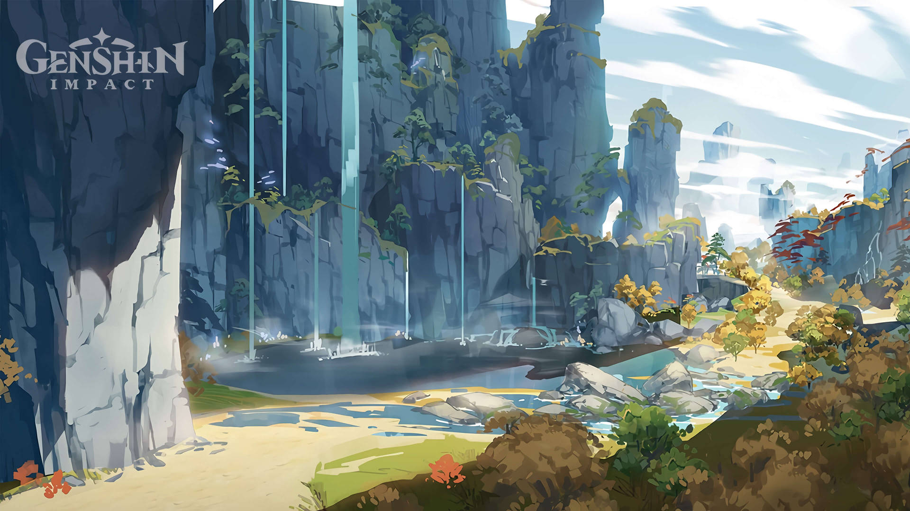
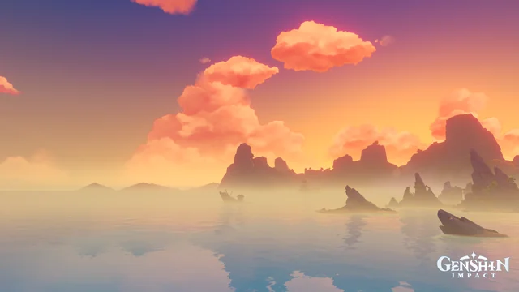
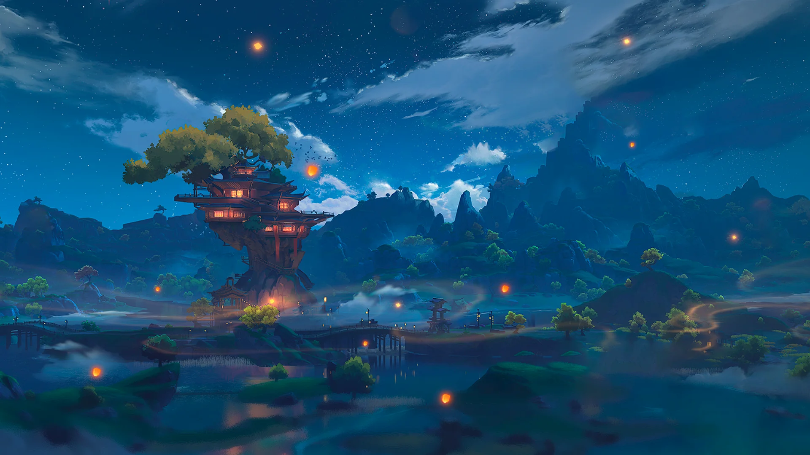

```{r setup, include=FALSE}
library(flexdashboard)
library(tidyverse)
library(ggplot2)
library(dplyr)
library(gt)
library(scales)
library(stringr)
library(forcats)
```

```{r data, include = FALSE}

setwd("C:/Users/Administrator/Desktop/EDLD652FinalProj/data")

library(readxl)
edld652data <- read_excel("C:/Users/Administrator/Desktop/EDLD652FinalProj/data/edld652data.xlsx")
View(edld652data)

thematic <- read_excel("C:/Users/Administrator/Desktop/EDLD652FinalProj/data/thematic.xlsx")
View(thematic)

min_t <- read_excel("C:/Users/Administrator/Desktop/EDLD652FinalProj/data/minor_t.xlsx")
view(min_t)
```

```{r manipulations, include = FALSE}
st_per_year <- edld652data %>%
  count(year, sentiment)
print(st_per_year) 

st_per_year_key <- edld652data %>%
  count(year, sentiment, keyword)
print(st_per_year_key)

st_per_year_key_filtered <- st_per_year_key %>%
  filter(keyword != "Inclusion")
```

```{r themes, include = FALSE}
smry <- thematic %>%
  group_by(year, theme) %>%
  summarise(count = sum(count), .groups = "drop")
```

```{r minor, include=FALSE}
top_20 <- min_t %>%
  arrange(desc(count)) %>%
  slice_head(n = 20) %>%
  mutate(highlight = ifelse(str_detect(minor_t, "Game"), "Game-related", "Other"))
```

# Project Description 

### **Overview**

This analysis delves into how players react to representation of in-game content, emphasizing the importance of identity in games like Genshin Impact (GI), and the social structures and power dynamics that influence player behavior.A focus on the platform Reddit is based on its content creation dynamics, which are entirely user-generated (de Wildt, 2020), which continues to draw the interest of social science research (Hanson et al., 2023). The platform’s communities, or subreddits, operate under self-governance, with moderators by their personal interests, in this case, video games, and in particular, miHoYo’s GI.

These dynamics will generate an environment where users who self-identify with the game or the community, are at liberty to post, comment, and share content in the subreddit, that reflects their own opinions, and worldviews (Bergstrom & Poor, 2022). This process of socialization, which assists community-building and identity self-construct, is especially salient in forum-based platforms (Bowman et al., 2022).

Fans of a game interact with official and unofficial content, which includes user-generated content in specific subreddits (de Wildt, 2020). For fans of GI, the most popular of the subreddits is r/Genshin_Impact, with over 2.6 million members (Reddit, 2024). Just like the majority of Reddit, users of the GI subreddit primarily express themselves in English and originate from WEIRD (western, educated, industrialized, rich, and democratic) countries (Hanson et al., 2023; SemRush, 2024).

### **Methodology**

To properly gauge the discourse in the target subreddit, we conducted a thematic analysis, considering all the posts that matched our keywords, starting June 7, 2019, the launch of the subreddit to August 2024. We applied methodology previously implemented (Bowman et al., 2022; Hanson et al., 2023) that studied major themes and sentiment from discourse expressed by redditors, regarding games, their experiences, and reactions.

The researchers independently coded a subset of an initial random sample of 30 posts, in order to identify recurrent thematic motifs and tone (positive, negative, mixed, and random) of the examined publications and reach intercoder reliability. We have used traditional Diversity, Equity and Inclusion framework as a base for the major themes in the analysis. Based on these findings, a codebook was created, aggregating minor themes and matching them into the DEI broader categories, which encompass more variety of perspectives taken from the discourse, and allow for more generalizable classifications.

For our analysis, we've used the following keywords: representation, diversity, equity and inclusion. Posts that had the words used in gaming context, without acknowledging traditional DEI framework were excluded. Posts that have visuals or videos were also excluded. A total of 171 posts remained are part of the final sample.

## Image

```{r}

```

```{r}

```

```{r}

```

---

# RQ1 Basic

Video games are often called training grounds for new technologies, places for experimentation, and children’s playgrounds (Nieborg & Foxman, 2023), and their industry is blossoming, however, long-standing problems with representation remain viral and turbulent.

Games are hegemonic spaces, where the presence of marginalized communities is diminished and compromised (Gray, 2014). Nakamura (2015) suggests that players from different backgrounds are put in unequal settings, and one available method to achieve equality is a meritocracy, which she calls the “cruelest of optimism”. Games over-represent males and white adults, resulting in the systematic exclusion of females, people of color, nonbinary, and elderly (Williams et al., 2009).  

*RQ1. What are the sentiments of Genshin Impact players toward the representation displayed in the game's content?*

### Line plot with points

```{r}
ggplot(st_per_year, aes(x = year, y = n, color = sentiment, group = sentiment)) + 
  geom_line(size = 1.2) + 
  geom_point() +
  scale_color_viridis_d(option = "plasma") +
  labs(
    title = str_wrap("Genshin Impact Player's Sentiments about Representation", width = 30),
    x = "Year",
    y = "Count",
    color = "Sentiment", 
    caption = "Data source: r/Genshin_Impact"
  ) +
  theme_minimal() + 
  theme(
    plot.title = element_text(face = "bold", size = 18, hjust = 0.5),
    axis.text = element_text(size = 12),
    axis.title = element_text(size = 14)
  )
```

### Faceted line plot

```{r}
ggplot(st_per_year_key, aes(x = year, y = n, color = sentiment, group = sentiment)) + 
  geom_line(size = 1.2) + 
  geom_point(size = 1.5) +
  scale_color_viridis_d(option = "plasma") +
  facet_wrap(~keyword) +
  labs(
    title = str_wrap("Genshin Impact Player's Sentiments per Keyword", width = 40),
    x = "Year",
    y = "Count",
    color = "Sentiment", 
    caption = "Data source: r/Genshin_Impact"
  ) +
  theme_minimal() + 
  theme(
    plot.title = element_text(face = "bold", size = 18, hjust = 0.5),
    axis.text = element_text(size = 12),
    axis.title = element_text(size = 14), 
    axis.text.x = element_text(angle = 45, hjust = 1))
```

# RQ1 New

**Plot 1**
This plot is more polished and informative compared to the initial one. The following key improvements have been made:

Enhanced readability through title, subtitle, axis labels, and grid adjustments.
The addition of trend lines and points for better data presentation.
Cleaned up background and more precise positioning for better data focus.

**Plot 2**
This plot is better because it focuses on clarity, readability, and comparison:

It adds faceting to break the data into manageable chunks, using !keyword to remove one of them with limited input.
The X-axis customization improves readability by reducing clutter.
Angling the X-axis labels makes them easier to read.
The plot includes smoothed lines to better visualize trends over time.
Improved formatting makes the plot more accessible and aesthetically pleasing.

Together, these adjustments make the plots more informative, engaging, and easier to interpret, especially for viewers comparing sentiment trends and across multiple keywords.

### Line plot with smooth trend lines.

```{r}
ggplot(st_per_year, aes(x = year, y = n, color = sentiment, group = sentiment)) + 
  geom_line(linewidth = 1.2) +
  geom_point(size = 3, shape = 21, stroke = 1.5) +
  geom_smooth(method = "lm", aes(group = sentiment, color = sentiment), linetype = "dashed", linewidth = 0.8, alpha = 0.1) +
  scale_color_viridis_d(option = "plasma") + 
  labs(
    title = str_wrap("Genshin Impact Player's Sentiments about Representation", width = 35),
    x = "Year",
    y = "Count of Sentiment",
    color = "Sentiment Category", 
    caption = "Data source: r/Genshin_Impact"
  ) +
  theme_minimal() + 
  theme(
    plot.title = element_text(face = "bold", size = 20, hjust = 0.5),
    plot.subtitle = element_text(size = 14, hjust = 0.5),
    axis.text = element_text(size = 12),
    axis.title = element_text(size = 14),
    axis.title.x = element_text(margin = margin(t = 15)),
    axis.title.y = element_text(margin = margin(r = 15)),
    legend.title = element_text(size = 13),
    legend.text = element_text(size = 11),
    panel.grid.major = element_line(color = "gray90", linewidth = 0.5),
    panel.grid.minor = element_blank()
  ) +
  coord_cartesian(expand = FALSE)
```

### Faceted line plot with smoothed trend lines.

```{r}
ggplot(st_per_year_key_filtered, aes(x = year, y = n, color = sentiment, group = sentiment)) + 
  geom_line(linewidth = 1.2) + 
  geom_point(size = 3, shape = 21, stroke = 1.5) +
  geom_smooth(method = "lm", aes(group = sentiment, color = sentiment), 
              linetype = "dashed", linewidth = 0.8, alpha = 0.1) +
  scale_color_viridis_d(option = "plasma") + 
  facet_wrap(~keyword) +
  scale_x_continuous(
    breaks = seq(min(st_per_year_key_filtered$year), max(st_per_year_key_filtered$year), by = 2)
  ) +
  labs(
    title = str_wrap("Genshin Impact Player's Sentiments per Keyword", width = 35),
    x = "Year",
    y = "Count of Sentiment",
    color = "Sentiment Category", 
    caption = "Data source: r/Genshin_Impact"
  ) +
  theme_minimal() + 
  theme(
    plot.title = element_text(face = "bold", size = 20, hjust = 0.5),
    plot.subtitle = element_text(size = 14, hjust = 0.5),
    axis.text = element_text(size = 12),
    axis.title = element_text(size = 14),
    axis.title.x = element_text(margin = margin(t = 15)),
    axis.title.y = element_text(margin = margin(r = 15)),
    legend.title = element_text(size = 13),
    legend.text = element_text(size = 11),
    panel.grid.major = element_line(color = "gray90", linewidth = 0.5),
    panel.grid.minor = element_blank(),
    axis.text.x = element_text(angle = 45, hjust = 1)
  )
```

--- 

# RQ2 Basic

The representation of identity is crucial in the current media environment, as it reflects and shapes society and its functions over time (Craig & McInroy, 2014). Identity can be described as a collection of interpretations that delineate individuals based on beliefs, social groups, and the distinct qualities that set them apart as individuals (Stets & Burke, 2014). 

The portrayal of diverse identities that focus on race, gender, and sexuality in media has increased in the past few years, particularly in the United States (Scharrer et al., 2022), which does not mean that bigotry or systemic oppression decreased (Moody-Ramirez et al., 2023). As these representations increase, nuances and implications of representation arise, such as false representations or no representation at all, which is also known as “symbolic annihilation” when the group is absent from the media (Scharrer et al., 2022).

*RQ2: What is the discourse around representation by Genshin Impact players on Reddit?*

### Heatmap

```{r}
ggplot(smry, aes(x = year, y = theme, fill = count)) +
  geom_tile(color = "white") + 
  scale_fill_gradient(low = "white", high = "red") +
  labs(
    title = "Major Theme Occurance Over Years",
    x = "Year",
    y = "Theme",
    fill = "Usage Count",
    caption = "Data source: r/Genshin_Impact"
  ) +
  theme_minimal() +
  theme(
    plot.title = element_text(face = "bold", size = 18, hjust = 0.5),
    axis.text = element_text(size = 12),
    axis.title = element_text(size = 14),
    axis.text.x = element_text(angle = 45, hjust = 1)
  )
```

### Ranked bar chart

```{r}
ggplot(top_20, aes(x = reorder(minor_t, count), y = count)) +
  geom_col() +
  coord_flip() + 
  labs(title = "Top 20 Minor Themes",
       x = "Minor Themes", 
       y = "Count",
       fill = "Category",
      caption = "Data source: r/Genshin_Impact") +
  theme_minimal()
```

# RQ2 New

**Plot 3** Better Theme Ordering with fct_reorder, ensures that themes are ranked by frequency, making the most important themes appear at the top instead of a random order.
More Informative Color Scale using scale_fill_viridis_c is colorblind safe, more easy to interpret and matches the other vizualizations.
Added Data Labels; Shows actual counts directly on the heatmap, eliminating the need to rely solely on color intensity.
Cleaner Grid and Formatting making the heatmap look sleeker and less cluttered; Improved font sizes & axis text styling for better readability.

**Plot 4** The version I presented was already in a good shape, I've added a count to each of the minor themes and improved readability. Using color mapping with fill = highlight gives the plot an additional layer of information. This visually separates the data based on categories, helping the viewer quickly identify important information. I've used coord_flip and scale_fill_viridis as always. 

### Heatmap with counts in ascending order

```{r}
ggplot(smry, aes(x = year, y = fct_reorder(theme, count, .fun = sum, .asc = TRUE), fill = count)) +
  geom_tile(color = "white") + 
  geom_text(aes(label = count), color = "black", size = 3) +
  scale_fill_viridis_c(option = "plasma", direction = -1, limits = c(min(smry$count), max(smry$count))) +
  labs(
    title = "Major Theme Occurrence Over Years",
    x = "Year",
    y = "Theme",
    fill = "Usage Count",
    caption = "Data source: r/Genshin_Impact"
  ) +
  theme_minimal() +
  theme(
    plot.title = element_text(face = "bold", size = 20, hjust = 0.5),
    axis.text.x = element_text(angle = 45, hjust = 1, size = 12),
    axis.text.y = element_text(size = 12),
    axis.title = element_text(size = 14),
    legend.title = element_text(size = 13),
    legend.text = element_text(size = 11),
    panel.grid = element_blank()
  )
```

### Ranked Bar Chart with Highlights
```{r}
ggplot(top_20, aes(x = reorder(minor_t, count), y = count, fill = highlight)) +
  geom_col() +
  scale_fill_viridis_d(option = "plasma", begin = 0.2, end = 0.8) + 
  coord_flip() + 
  geom_text(aes(label = count), 
            position = position_stack(vjust = 0.5),
            size = 4, color = "black") +
  labs(title = "Top 20 Minor Themes",
       x = "Minor Themes", 
       y = "Count",
       fill = "Category",
       caption = "Data Source: r/Genshin_Impact") +
  theme_minimal() +
  theme(
    plot.title = element_text(face = "bold", size = 18, hjust = 0.5),
    axis.text = element_text(size = 12),
    axis.title = element_text(size = 14)
  )

```

---

# References

**References**

- Bergstrom, K., & Poor, N. (2022). Signaling the Intent to Change Online Communities: A Case From a Reddit Gaming Community. Social Media + Society, 8(2), 205630512210968. https://doi.org/10.1177/20563051221096817

- Bowman, N. D., Bowen, D. A., Mercado, M. C., Resignato, L. J., & De Villemor Chauveau, P. (2022). “I did it without hesitation. Am I the bad guy?”: Online conversations in response to controversial in-game violence. New Media & Society, 146144482210788. https://doi.org/10.1177/14614448221078865

- Craig, S. L., & McInroy, L. (2014). You Can Form a Part of Yourself Online: The Influence of New Media on Identity Development and Coming Out for LGBTQ Youth. Journal of Gay & Lesbian Mental Health, 18(1), 95–109. https://doi.org/10.1080/19359705.2013.777007 

- de Wildt, L. (2020). Playing at Religion: Encoding/decoding Religion in Videogames. https://doi.org/10.13140/RG.2.2.32599.70560/1

- Gray, K. L. (2014). Race, gender and deviance in Xbox Live: Theoretical perspectives from the virtual margins. Anderson.

- Hanson, K. R., Pascoe, C. J., & Light, R. (2023). “It’s Getting Difficult to Be a Straight White Man”: Bundled Masculinity Grievances on Reddit. Sex Roles, 88(3–4), 169–186. https://doi.org/10.1007/s11199-022-01344-8 

- Nakamura, L. (2015) “Racism, Sexism, and Gaming’s Cruel Optimism”. In Malkowski, J., & Russworm, T. M. (Eds.). (2017). Gaming Representation: Race, Gender, and Sexuality in Video Games. Indiana University Press. https://doi.org/10.2307/j.ctt2005rgq 

- Moody-Ramirez, M., Byerly, C., Mishra, S., & Waisbord, S. R. (2023). Media Representations and Diversity in the 100 Years of Journalism & Mass Communication Quarterly. Journalism & Mass Communication Quarterly, 100(4), 826–846. https://doi.org/10.1177/10776990231196894

- Nieborg, D. B., & Foxman, M. (2023). Mainstreaming and game journalism. The MIT Press.

- Reddit. (2024). R/Genshin_Impact [Subreddit]. Genshin Impact Official Subreddit. Retrieved March 25, 2024, from https://www.reddit.com/r/Genshin_Impact/

- Scharrer, E., Ramasubramanian, S., & Banjo, O. (2022). Media, Diversity, and Representation in the U.S.: A Review of the Quantitative Research Literature on Media Content and Effects. Journal of Broadcasting & Electronic Media, 66(4), 723–749. https://doi.org/10.1080/08838151.2022.2138890  

- SemRush. (2024). reddit.com—February 2024 Traffic Stats [Aggregator]. SemRush. Retrieved March 25, 2024, from https://www.semrush.com/website/reddit.com/overview/

- Stets, J. E., & Burke, P. J. (2014). Self-Esteem and Identities. Sociological Perspectives, 57(4), 409–433. https://doi.org/10.1177/0731121414536141

- Williams, D., Martins, N., Consalvo, M., & Ivory, J. D. (2009). The virtual census: Representations of gender, race and age in video games. New Media & Society, 11(5), 815–834. https://doi.org/10.1177/1461444809105354 

